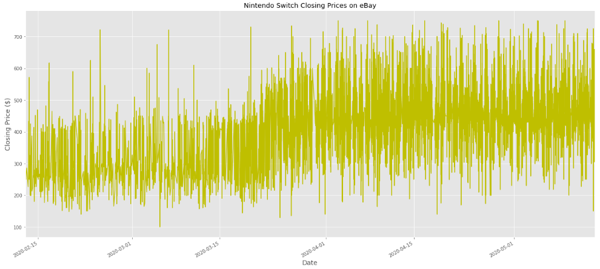
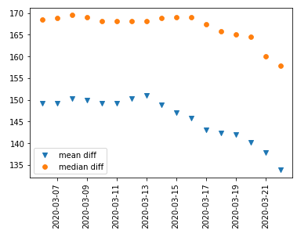
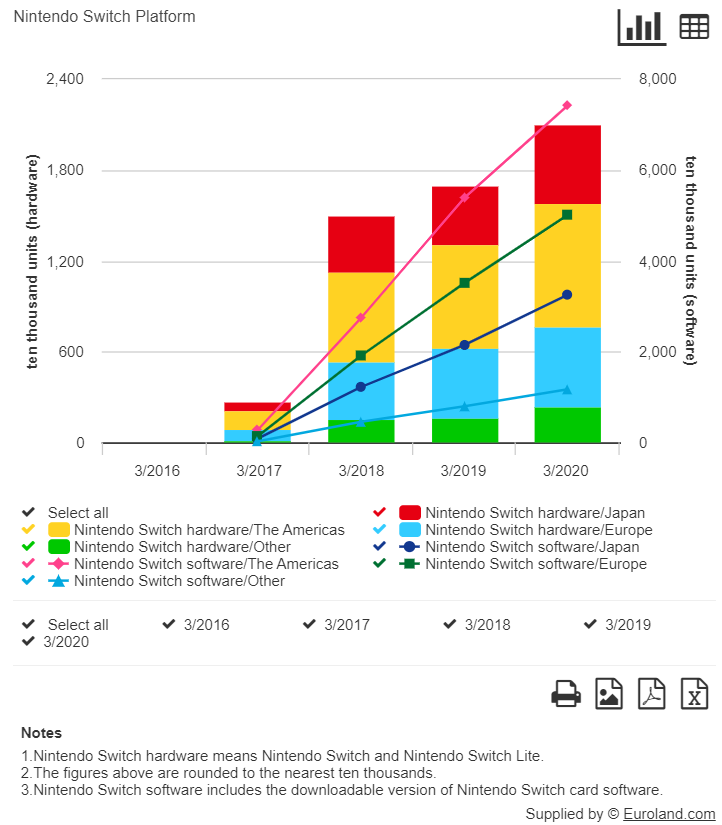

# Effects of COVID-19 Shelter-In-Place on Nintendo Switch Resale Pricing
>### In this project, we will be exploring the imbalance of supply and demand for the Nintendo Switch reflected in closing prices on eBay.

## Introduction:
The **Nintendo Switch** was released in March 2017 at a retail price of $299.99 as a successor to the Wii U, which had ended production 2 months prior. As Nintendo's 8th generation gaming console, the Switch competes with Microsoft's Xbox One and Sony's PlayStation 4 - although many experts will agree that it has carved out a niche market of its own. This is due to their ecosystem having much more universal appeal, with a wide focus on family friendly games for all ages and both genders. The dual delivery platform (physical cartridge / online download) and growing variety of games at every price point has ushered in a 'second wave' of growth for 2020, exacerbated by the **worldwide coronavirus pandemic.**

In August 2019, the original Switch was updated with a newer processor, translating into improved battery life. A month later, Nintendo released a handheld-only version of the console, the **Switch Lite** - at a retail price of $199.99. Merely 10 days after launch, the Lite had sold almost 2M units. Reported 2020 Q1 earnings revealed over 6M units sold for the Lite and almost 50M units for the original Switch. It was apparent that the Switch was **getting its second wind** when March sales doubled from 2019 to 2020. In addition, one of its most anticipated games - **Animal Crossing: New Horizons** - was released on March 20. Per [The Verge](https://www.theverge.com/2020/3/26/21195022/animal-crossing-switch-sales-japan-famitsu), almost 2M physical copies (excluding download purchases!) were sold in ***just the first 3 opening days in Japan alone.*** Almost 400k Switch systems were also sold in Japan the week following the game's release, setting a new record.

**Beginning on March 16**, the state of California mandated a stay-at-home / shelter-in-place policy to prevent medical facilities from being overwhelmed by the spread of COVID-19. Many states (but not all) put forth similar mandates in the following weeks, shuttering all but essential businesses across the US and requiring residents to stay at home and follow social distancing rules when in public. Panicked buying of emergency supplies ensued - notably affecting toilet paper, hand sanitizer and face masks. Some opportunists hoarded these supplies and attempted to resell these items for large profits, thwarted by laws preventing this type of predatory behavior.

However, these laws do not extend to non-essential products and many Americans realized that now would be a great time to have a Nintendo Switch at home to help pass the time (and keep the kids occupied since schools were shut down). This surge in demand ran headlong into a drop in supply as the worldwide pandemic started taking hold, affecting production at factories in Asia. Unnamed factory sources claimed that April shipments would be primarily affected - **as simultaneously the pool of interested Switch buyers started increasing exponentially.**

>**A perfect economic storm was brewing** - the effects of which were captured by Switch closing prices on eBay.

Econ 101 informs us that price equilibrium occurs when market supply appropriately matches demand (Price=P1 given Supply=S at Quantity=Q1 given Demand=D). If supply were to suddenly reduce (S-->S2), the equilibrium price would increase. The same goes for a sudden demand increase (D-->D2 - FOMO being the #1 reason these days).
>The timing of a flagship title release, millions of people forced to stay home and disrupted supply lines exacerbated by the increasing use of [online purchasing bots](https://www.washingtonpost.com/local/meet-the-virginia-teen-who-created-bird-bot-fueling-nintendo-switch-hoarders/2020/04/27/345919fe-889f-11ea-ac8a-fe9b8088e101_story.html) by resellers - all contributed to **a market with sellers eager to maximize profits and buyers stretching their wallets for how badly they wanted one.**

### Jupyter Notebooks
- `Collect_Clean.ipynb` : perform web scraping using Beautiful Soup, cleaning up data and organizing into dataframes.
- `EDA_Model.ipynb` : exploring data, answering domain related questions and delivering insights. Feature creation and engineering for building a linear regression model to predict closing prices.

## Data Collection
I had specifically set out to avoid using eBay's API so I could put myself through the paces of scraping data from the internet manually. In retrospect, I'm glad I did but would prefer not to do it again.. looking back I'd have to admit I made myself worker harder but not smarter. The constantly changing nature of eBay's website and mistakes by sellers entering information in the wrong fields presented many challenges but it was a huge learning experience! The final dataset included over 14k listings/rows and 10 feature columns.

**Date Range:** Feb 13 - May 13, 2020  
**eBay Filters:** Nintendo Switch, Sold/Completed Listings, Shipping to US/Canada only.  
**Features:** Ending Date/Time, Listing, Title, Final Closing Price, Shipping Cost, Unit Condition, Listing Page Link, Seller Location, Username, Feedback Score (count and percentage positive)

## Exploratory Data Analysis (EDA)
Plot of sold listing prices over entire time period:

We can see a noticeable trending upward in average Switch prices starting in mid March, when the first US shelter-in-place (SIP) / shutdowns were put in place. The line plots grow denser as more units started flooding the market as the average price increased by \$125-140. Then I sought to identify the optimal cutoff date for separating the 'before' and 'after' group that demonstrated the greatest average price difference.
>As seen below, this date turned out to be the **Friday the 13th** before CA announced their SIP mandate the following Monday!

One thing to note is that the mean difference starting to drop a few days earlier than the median is indicative of small pockets of 'panic bidding' driving up individual listings (likely creating high outliers) before the effect spread more broadly across the market.

Below we have 2 box and whiskers plots 'zooming' in on the weeks of transition, showing the spread of daily prices resampled hourly. The 1st was resampled with ***mean*** hourly prices and the second with ***median*** hourly prices. The stark visual difference for the median plot starting on Mar 23 really shows how buyers and sellers responded to various market pressures. The **pricing floor** - around 2/3 of the Switch's retail price - instantly jumped to about 1/3 ***more*** than its retail price exactly 7 days after CA became the first US state to SIP on Mar 16. This bit of lag time makes a lot of sense as it took most people about a week to adjust to this new way of life - **freeing up a ton of time for video games.**

### Question 1: How large (or small) is the pool of sellers?
    a. How diverse is the pool? Are some 'power sellers' dominating the market?  
    b. Are the 'power sellers' consistently selling for higher closing prices?
    
I found that power sellers (defined as selling at least 5 Switches in our timeframe) definitely were doing their part - they made up only 5% of the seller pool and were responsible for 25% of listings. However, they were not consistently selling for higher prices than your average seller. For the most part, every seller was enjoying a broad market uplifting effect of a 50% premium over retail price. Almost 2/3 of all sellers sold exactly 1 unit, many of which were pre-owned and probably collecting dust. On average, these used units were sold for over **\$400!**

Below we can see just how much of a surge there was in number of Switches being sold daily once SIP began.

### Question 2: How has the geography of sellers changed since SIP began?
Not much since the top 3 states with Switches flowing out of them remained the same: California, New York and Florida. However, a more than 5 fold quantity increase per month began after Mar 13.

### Question 3: Does the condition of the Switch (brand new vs not) matter as much during a shortage?
I discovered that before and after SIP - the average price difference between new and used remained steady at around \$30-40. The low depreciation is similar to what we would expect from Apple products.

## Linear Regression Model to Predict Price
After evaluating various methods of prediction modeling, since we were mostly working with the title text and the scraped features had a weak price correlation - I felt it was most appropriate to perform a simplified version of NLP that looks for key words that I noticed commonly appeared in higher priced listing titles. Standard NLP techniques would be more appropriate if I had the entire listing body description scraped as well as the title because then context and frequency of key words could be analyzed.

- 'SD' - includes additional SD card for additional storage
- 'AC' - includes the game Animal Crossing
- 'game' - includes additional game(s)
- 'case' - includes protective case
- 'con' - includes additional controllers
- 'Sp' - identified as a special/limited edition or bundle
- 'SIP' - before (0) or after (1) March 13

The model resulted in an R2 score of 0.47 which could be better but showed good normality and consistency with predictions. However what struck me the most was the coefficients coming in line with appropriate real world pricing and values for each feature. A less than brand new condition only dropped value by 20-50 and various accessories and add-ons would increase price by 10-60. Most importantly, the listing being before SIP vs after SIP resulted in a 140 price difference on average, exactly what we observed earlier.

## Conclusions

Nintendo spearheads a minority of companies that have enjoyed a tremendous surge in sales due to the global coronavirus pandemic. It should be no surprise that they aren't shy about publicizing the success of the Switch per the chart above from their [website.](https://www.nintendo.co.jp/ir/en/finance/hard_soft/number.html)
Even still today in mid-May 2020, one can do a cursory search on Google Shopping, Amazon and confirm that either units (sold at retail price) are out of stock or being marked up anywhere from 40-100%.

Some retailers that prioritize their bottom line above all else are getting hammered in their site reviews (but units are in stock!):

## Closing Remarks, Reflection, Further Work

When I had originally chosen this capstone project topic, I had thought that one of the pitfalls would be finding creative ways to add complexity. I envisioned pulling every custom added image and text from every listing (even live ones!) and use the most impressive data scientist tools available: **unsupervised/deep learning techniques, NLP and image classifiers**. I was also adamant about scraping the html data manually so that I could gain a more comprehensive understanding vs using eBay's API and making the data collection portion much quicker.

What I was not prepared for was how much time I needed to set aside for **data collection** alone; then **data cleaning** which also took several magnitudes longer than I had anticipated (if 70-80% is normal, this project for me was **~90-95%**). I encountered unforeseen frustrations with the inconsistencies of eBay's site, which was prone to 'randomly' change the layout of a completed listing page: suddenly replacing the body with a similar (live) item ad, randomly losing a closed listing's page (correlated with how old the page was and exponentially more likely after 3 months), different and mutating layouts for power sellers and stores, inconsistencies with where/if information would be stored. In addition, mistakes made by sellers when describing their items - often filling out information incorrectly in pre-defined fields - or sometimes intentionally, attempting to stand out from the crowd.

Further work would involve using the eBay API to make data collection easier/faster and pull text/images from listings if possible. Building a simple app or website that can dynamically update data from eBay with real time pricing and changes, possibly allowing for buyers to be alerted when the pricing premium spread all over the market starts to abate.